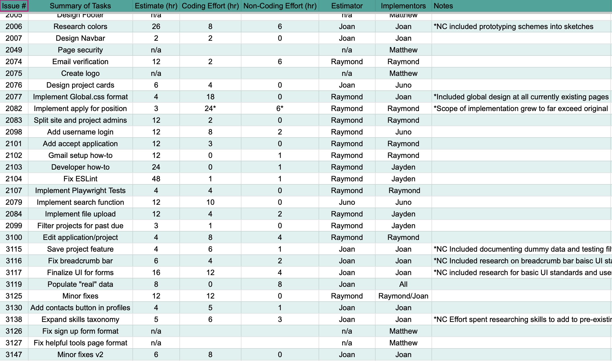

  
   
  <em>Screenshot of time estimates and tracking.</em>

Tracking manhours for work completed is nothing novel. Predictions of manhours to complete a task is also not uncommon, although striving for the most accurate estimates is a Sisyphean effort. A well understood objective with well understood timelines makes for an accurate plan, and an accurate plan is invaluable for knowing if a project is behind schedule. In a commercial environment these are metrics that can be used to determine team contributions, monitor productivity (and by extension, morale), and save time, money, and customer frustration by enabling better planning and schedule making.

## Scientific Wild Ass Guess

In an educational environment, particularly one with inexperienced teams, estimations become much more difficult. To some degree there is a lack of motivation: so long as the project is completed to satisfaction, each student only need consider how much work they wish to expend for their grade. An inability to accurately estimate timelines makes the act of estimating feel futile, although doing the estimates has intrinsic value in learning how to better estimate. For the ICS 314 final project, there would likely be some benefit in spelling out estimation expectations sooner than this essay. To my knowledge, none of Team UHp! did better estimates than looking at clocks and giving best guesses. Those guesses were based largely on estimates throughout the year during WODs and other experiences, although the accuracy remained terrible.

In terms of project implementation, the benefits of our estimates are limited, if at all existant. Estimates were either wildly over or wildly under actual completion times for the most part, and knowing they were not likely to be accurate removed any value in using the estimates for planning. The majority of the value lies in each student getting additional experience in approximating time costs and in the muscle memory of tracking the hours.

## Lessons Learned

With the experience of developing a webapp and having the first hand knowledge of time required, there are several changes I would make to estimation and tracking for future projects. The first is that estimates should be closer to actual effort, and therefore better for planning. Having a more robust tracking system in place and explaining the procedures will provide better information on team contributions and tracking personal performance.

AI usage on my end was extensive inside the code editor. CoPilot was invaluable in correcting typos, fixing syntax, or identifying code that did not function correctly and explaining what changes would enable functionality. AI use on the internet was limited to google search's AI and Claude.ai: google search for consolidating search results, and Claude for teaching new concepts or explaining why code not flagged by CoPilot was not functioning. It was particularly helpful when setting up Gmail automation: the guides online were largely outdated, incomplete, or borderline incomprehensible. Claude was able to produce step by step instructions with an initial prompt of "what is the easiest way to add automated emails to a webapp using gmail" followed by prompts requesting more details on specific features as needed. If I had started with Claude for automation instead of trying to search the internet myself, it would have taken less than half the 24 hours used finding and failing to implement various "solutions" recommended online.

In summary, the act of attempting to estimate and track time held little value for the project but valuable lessons for future work. It also indirectly demonstrated ways to use tools to abbreviate some of the most time costly parts of learning.
