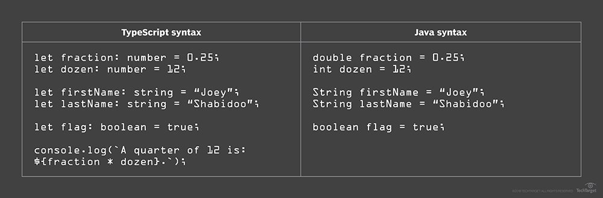

# Pi and I: ICS 314 and Typescript Are Fine

Attempting a Bachelor of Science for the second time and being twice the age of classmates, a regular schedule and normalized syntax are appreciated. As such, the strict type declarations of Typescript and the persistent staccato of short, fast exercises are delightful in ways unexpected.
	
## What's Great About Types

Eighteen years and half a planet ago, Embry-Riddle Aeronautical University taught "Introduction to Programming" with C and C++ to an unmotivated and uninformed student. Today, that same student appreciates the structure and logic in programming combined with the utility of object oriented programming. What is not appreciated, is the idea that the interpreter or compiler should be in charge of determining what the programmer meant. As such, Typescript takes what would be one of the least favorite aspects of Javascript programming (dynamic variables) and replaces it with static variable definitions. This provides continuity between C, C++, Java, and now Typescript across decades of learning.
	
Beyond the continuity, Typescript *feels* like Java. Some of the syntax varies, but after two semesters of Java in ICS 111 and 211 the use of Typescript allows students to jump into web programming without needing to completely relearn the basics. For a full time student working part time and taking several "intensive" courses simultaneously, familiarity is a boon that cannot be overestimated.

([McKenzie], 2018](/essays/bibliographies/pi-and-i.bib))
	
## Athletic Software Engineering

Reading Philip Johnson's "Athletic Software Engineering" presents a realistic depiction of the so-called cubicle workflow: meetings, priority reassignment, work, repeat until work is complete. Long term timelines worked in the military, but they encouraged complacent maintenance of the status quo over efficiency and improvement. In a learning environment, students should be striving to learn the best methods, the most efficient designs, the tips and tricks their instructors have accumulated over decades. The concept of athletic assignments "develop(s) the skills to succed in a startup weekend environment" ([Johnson, 2013](/essays/bibliographies/pi-and-i.bib)): fast paced and efficient programming with an emphasis on *understanding* the code over *memorizing* the code.
	
Thirteen and a half years in the Navy prepares a Sailor for dealing with near-constant pressures and stresses: athletic style exercises will be a familiar partner. Additionally, the repeated smaller objectives favor continuous use of programming skills over the single, overwhelming deadline that gets procrastinated until the final few days. There are many resources that research and discuss the benefits of breaking large tasks into smaller chunks and the value of repetition on comprehension, and personal experience reinforces those conclusions.
	
## Too Long; Didn't Read
	
In conclusion, ICS 314 utilizes tools already familiar to its students and methods to encourage the development of critical thought and efficiency. All of these factors can only been seen as a boon, and the class promises to be informative, challenging, and interesting.
