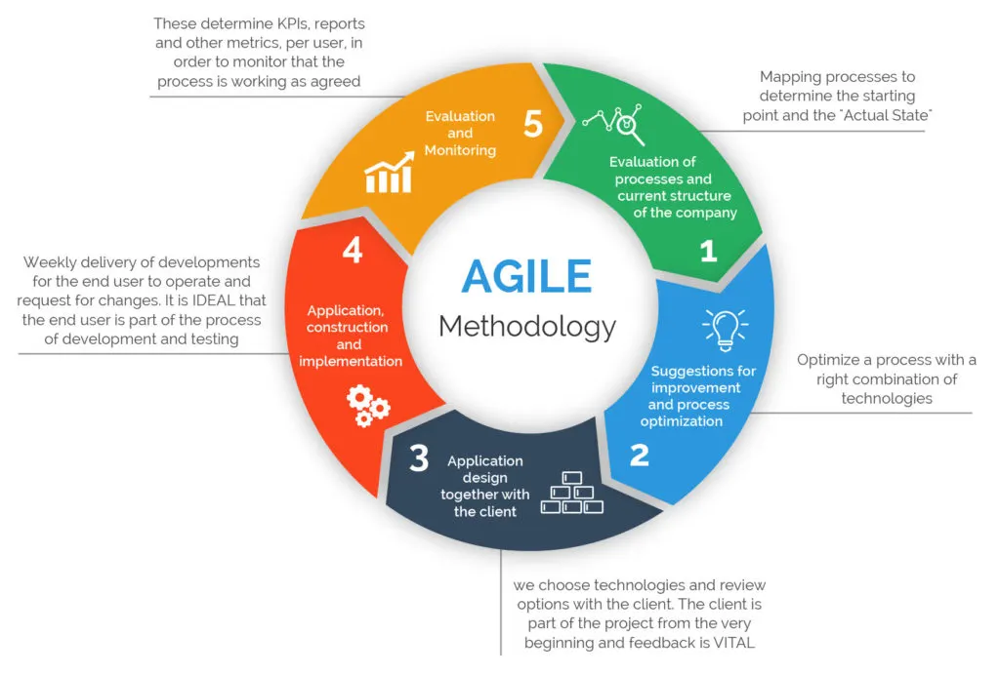

  
   
  <em>A diagram describing an Agile development cycle.*</em>

Classes at university multitask lessons. An obvious lesson is the subject of the course: for ICS 314, software engineering. Less obvious are the skills necessary to perform the subject of the course: programming, logic, time and people management, etc. Least obvious, but often most valuable, are life skills: task prioritization, self-learning, and how to motivate oneself among others. As a non-traditional student life experiences have covered many of these lessons, but a refresher is never unwelcome.

## Wisdom Saving Throws

Among all the takeaways ICS 314 left, by far the most immediately useful was demystifying GitHub and open source projects. Without a strong incentive to learn how it functions, the site is not incredibly newcomer friendly and there have been several occasions that a program or app have been discarded as unnecessary due to an inability to quickly figure out how to download and install from GitHub.

Having been forced to use GitHub to submit tests and assignments, the barrier to use is far lessened. Creating repositories, templates, committing and pulling are muscle memory, although many functions remain yet unused. The greatest value in learning GitHub is lowering the entry barrier to participating in open source projects. Many such projects utilize GitHub for collaborating, and the (typically unpaid) people already working on the project are unlikely to want to hold someone's hand through setup. It further reduces the barriers to starting our own projects, giving developers a simple system for remotely hosting files and timelines and the tools to collaborate.

## Agility Bonuses

Another primary benefit was an introduction to Agile project management. As with most such named methods of project management, the system is not particularly unique: projects are broken up into smaller pieces that different teams can handle. This in turn allows for more specialization and _agile_ development with modularity being emphasized. Being exposed to GitHub Projects grants similar experience to Kanban and other such organizational tables, which are widely used in professional fields. If one change were made, perhaps a brief lesson on when systems such as Agile are valuable and when they are outshined by less distributed systems would be welcome.

## Strength Training

The last lesson discussed here is simply coding experience. Every ICS class to date has involved learning code, but very few (if any) have involved dealing with classmates and their code. Learning to code an entire program yourself is helpful, but learning to interpret and intermesh with the programs of others is a skill all its own. The final project for ICS 314 requires not only collaborating with our peers to create a functional webapp, but one that is also usable by people who are not necessarily versed in programming.

All told, while taking ICS 212, 311, and 314 simultaneously is not a course of action I recommend, Software Engineering has certainly been an enlightening class in many way.

*Image found at [Medium](https://medium.com/@sudarhtc/agile-project-management-methodology-manifesto-frameworks-and-process-f4c332ddb779).
