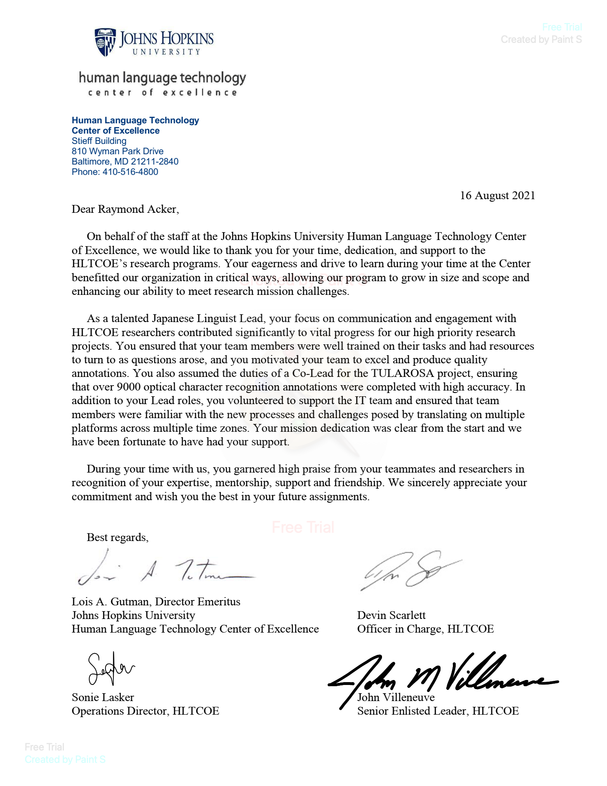

John Hopkins University (JHU) Human Language Technology Center of Excellence (HLTCoE) is a research and development institute that coordinates with various U.S. military branches to develop machine learning tools in the field of character recognition, among other projects.

I was invited by the Operations Director to participate as a Team Lead for the Japanese and other projects, in addition to supporting the IT department in user setup and troubleshooting from January through August, 2021. During that time, I performed thousands of character annotations across hundreds of images, reviewed annotations by team members, chaired progress and development meetings, coordinated with senior researchers, created and enforced policy, and ensured onboarding team members were able to utilize the various softwares necessary to their work.

During my time volunteering for JHU HLTCoE, I gained valuable insights into team management (personnel issues, task prioritization, scheduling, etc.), handling remote employees, how to make the most of meetings, and a little about machine learning. It was an incredible opportunity that I would happily participate in again!

You can learn more at the [JHU HLTCoE website](https://hltcoe.jhu.edu).

