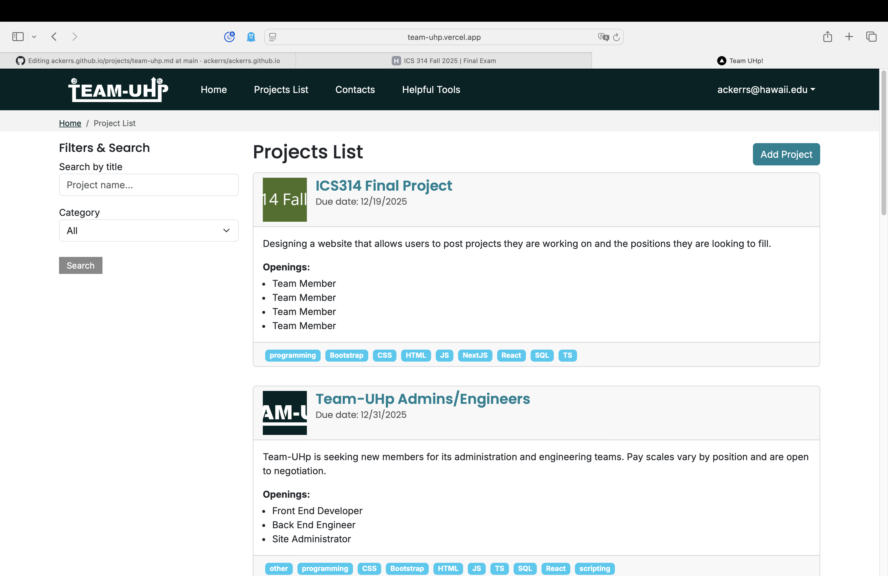
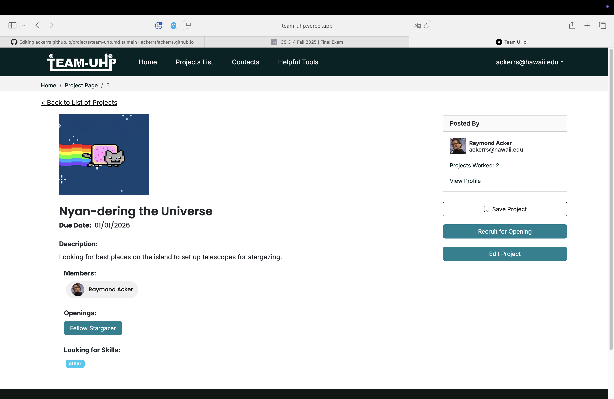

<a href="https://team-uhp.github.io">Team UHp! GitHub.io page</a>
<a href="https://team-uhp.vercel.app">Team UHp! Vercel application</a>
 
 
 

  Team UHp! (TU) was the brainchild of teammate Joan Zara when she learned of fellow students in a robotics class having difficulty learning how to program for a project. At its heart, TU is meant to be a way for students who need help with skills they don't have to find others who do have them.

## App Functionality

  The site provides limited functions to non-users or users not signed in. There are a handful of external links, primarily to the .io page, sign in, sign up, and forgot password, email, or username. Registering for an account sends a verification link to the provided email address, which must be visited to enable the account. The forgot pages will also send emails, as appropriate.

  Once signed in, users are able to view their profile, projects list, create a project, or visit a number of informational pages such as Helpful Tools, where they can find links to external websites our team found convenient. Each user's profile can be edited to include more information than was required at signup, but the most site-relevant changes come in the form of "skills" that users can add via dropdown menu.

  There are other ancillary functions around the site, but the meat of the site revolves around the projects list. The list is comprised of clickable project cards, which show some basic information about the project. Clicking a project will take the user to its informaion page, where the project openings are listed. Clicking a project opening moves to the opening's description, application link, and an array of the skills required/recommended for the position. The skills of each opening are conglomerated back at the project information page and fed into the project cards, and when users view the list it is sorted by how many of the project's skills match their own.

  Applying for an opening notifies project administrators via email that an application was received. Applicants are notified by email when their applications are accepted.

## Contribution

  My contributions to the project primarily regarded functionality. I developed the project list, project pages, opening pages, and application pages. I was responsible for implementing the majority of database schemas, validations, and actions, as well as integrating the automated emails and Vercel Blob for image handling.

  Conversely, I take little to no credit for the graphics design. My teammates did excellent work in graphics design, UI/UX formatting, handling the .io page, and more.

## Key Takeaways

  The biggest lessons in this project are hardly new, but always worth repeating. There's no such thing as too much time. Perfection is the enemy of achievement. Anything worth doing is worth doing right. Additonally, there are two ways of doing things: the right way, and again.

  Perhaps it is the smaller lessons that are the most interesting, though. If your database can benefit from interlinking, do it the first time. Going back to interlink after developing the majority of the site is _painful_.

  Break tasks into small bites, and don't feature creep your tasks. The project was fairly well broken down into pieces, but the number of times one task turned into checking off three tasks was more than zero. The page will still be there tomorrow.

  AI can be an excellent learning tool or a horrible crutch. Particularly with email implementation, I was unable to find a good how-to walkthrough on implementing Gmail as a free automated mailer. Claude.ai not only gave me step-by-step instructions, but was incredibly helpful at explaining why my syntax was not working for a language with which I have little experience. None of that could not be eventually accomplished by searching myself online, but an AI assistant expedited the search immensely.

  On the other hand, it would have been all too easy to simply throw a prompt at Claude, copy-paste the solution into each page, and keep throwing error messages at it until the code functioned. VSCode has a reasonable amount of crutch, in that it requires you have a coherent concept before it can correct the code. Unfortunately, if a user does not take the time to read explanations and learn from the mistake, they will have written a project and gained zero insights from it.

