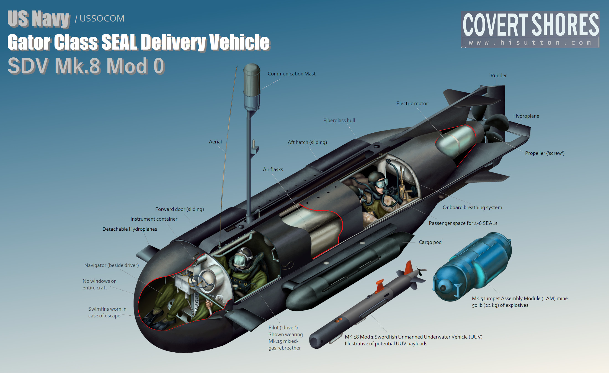

Naval Special Warfare Group 8 (NSWG8) Logistics Support Unit is a U.S. Navy command that provides a variety of support services to NSWG8, primarily focused around the SEAL Delivery Vehicle (SDV) platform. At various stages in an SDV's lifecycle, it will typically be sent from Joint Base Pearl Harbor Hickham, Hawaii to Panama City, Florida for inspection, overhaul, and operational testing. This project was the first and second attempt at performing the process locally, to save both time and money.

As one of two Electronics Technicians tasked with this project, my partner and I were responsible for assessing damages, developing a repair and overhaul plan, implementing a timeline, reporting status updates and setbacks, and the performance of the overhaul. Over the next five months, we succeeded in restoring both SDVs to like-new condition within the original timeline estimates and significantly under the budget allotted, despite repeated issues arising from a lack of readily available repair parts to excessive hardware corrosion in parts no longer manufactured.

This project reinforced many lessons regarding communication, time management, process controls, personnel management, and technical skills developed over the preceding 13 years in the U.S. Navy. The biggest challenge we overcame was the development of new policy for troubleshooting ground faults, as it required applying voltage to relatively sensitive circuitry and no local instructions existed prior. We achieved this by locating procedures from the Panama City facility, adapted the needlessly complex procedure for local use, and presented several iterations to leadership until the final procedure was approved.
